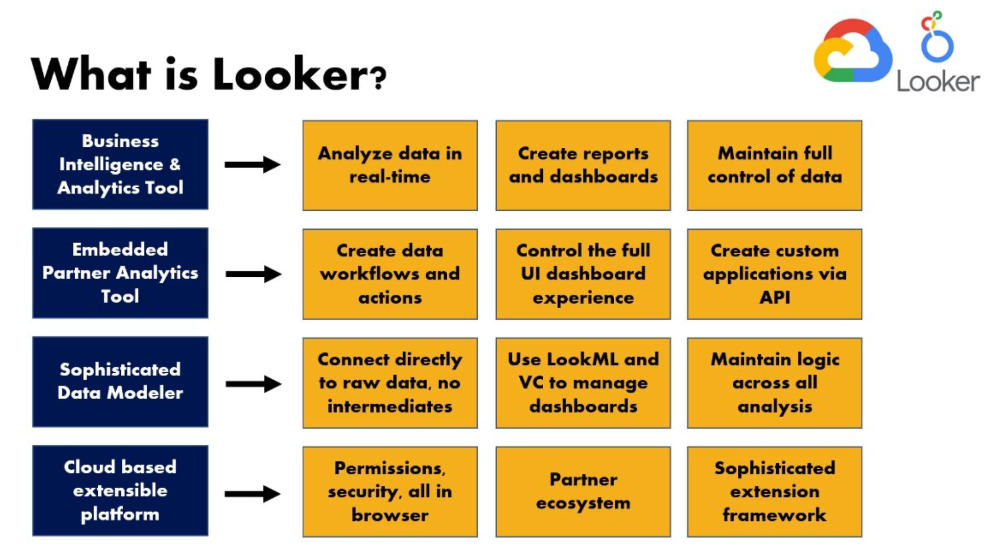
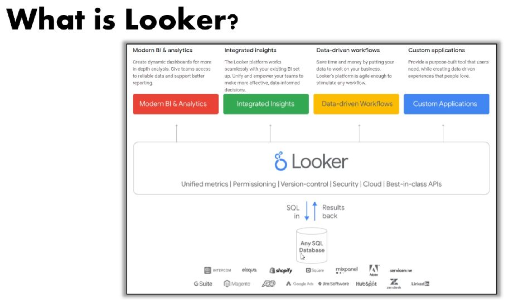
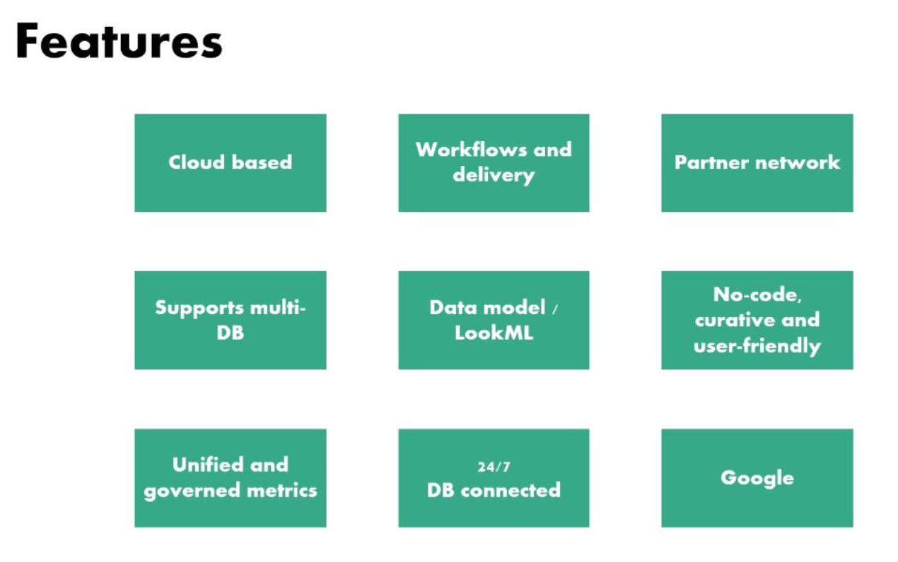
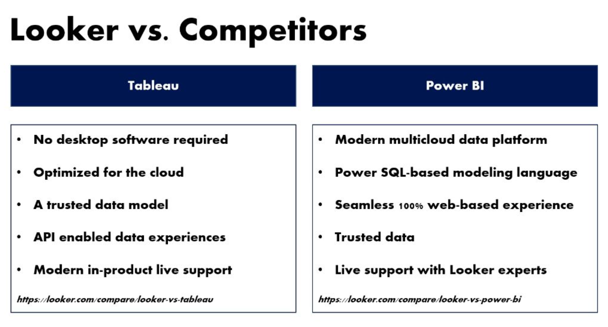
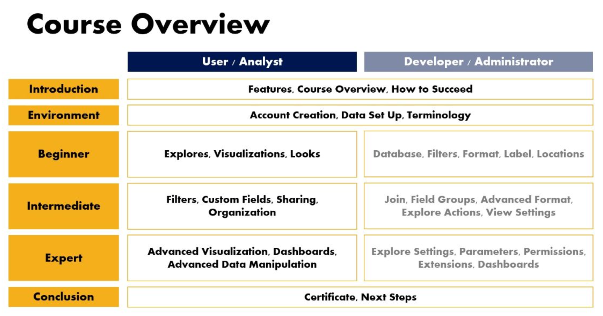

# 00 - Introduction

## Notes

- Cloud based is what makes it different to PowerBI or Tableau. It’s all in the browser.

- Looker uses LookML (the dictionary related information, the logic) and SQL queries.

- Usually you would need a SQL database, then an ETL (Extract, Transform, Load) and then PowerBI/Tableau, but now all you need is a SQL database and Looker. Looker gets rid of the intermediate layer.

- ETL - the process of combining data from multiple sources into a large, central repository called a data warehouse.

- A data warehouse is a central repository of integrated data from one or more disparate sources. Used extensively in business intelligence.

- A data lake is a system or repository of data stored in natural/raw format, usually object blobs or files.

- You can automate reports and it’s cloud-based, the major selling points.

- LookML - version control system, one of its best features.

- Because it’s cloud-based, your data is always up-to-date.

**Developer**

- Caroline Crandell - cecrandell - cecrandell19@gmail.com - [LinkedIn](https://www.linkedin.com/in/carolinecrandell/)
