# 01 - Environment

## Setting Up the Looker Sandbox Environment

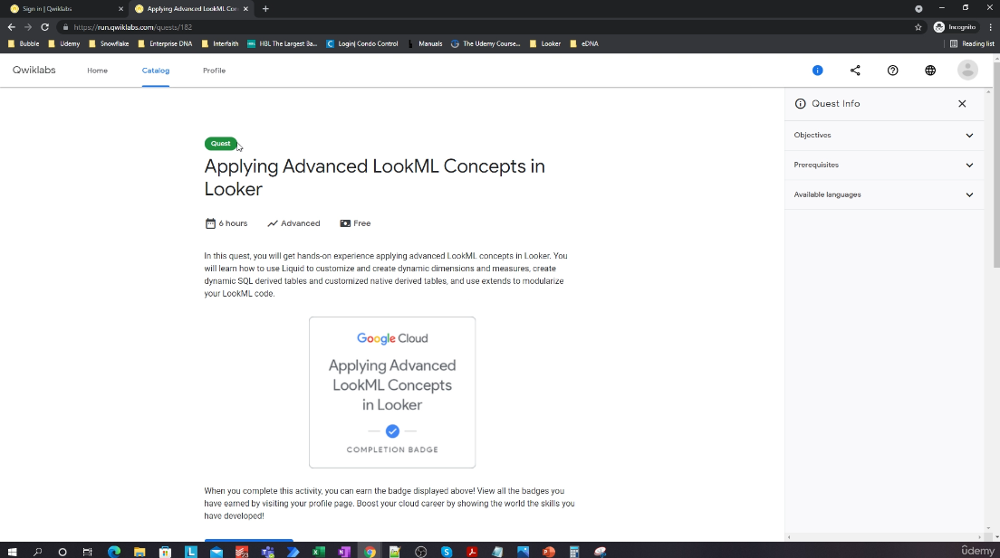
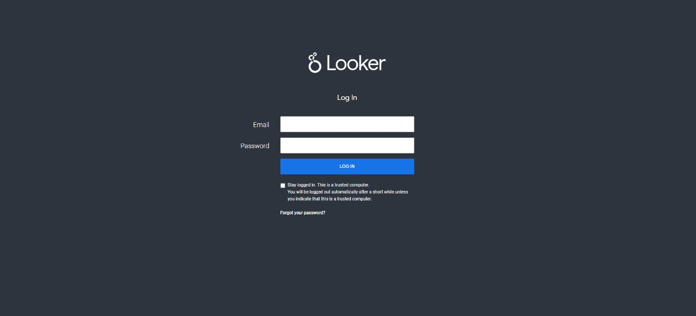
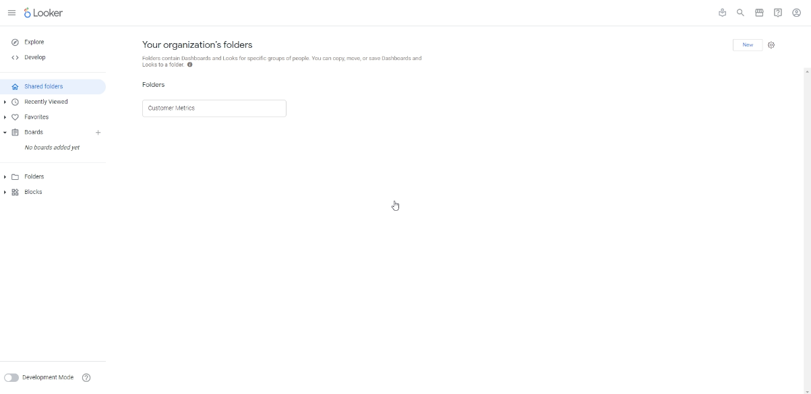

1. Select the Explore tab

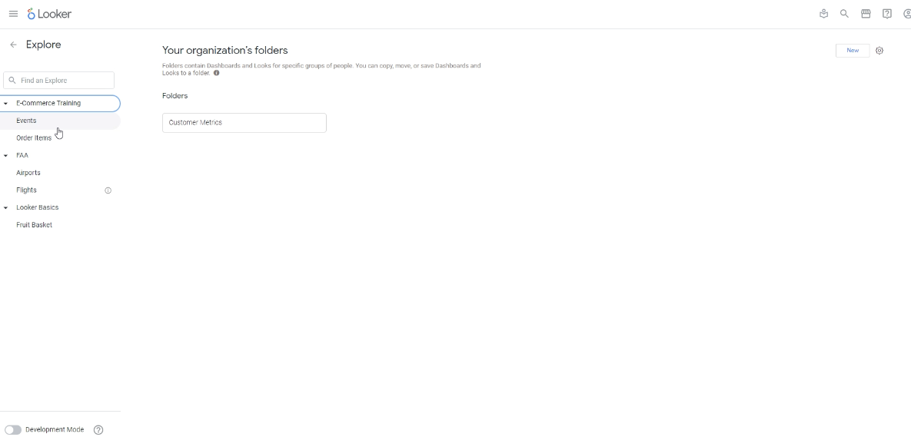

2. Toggle Development Mode and select the Develop tab

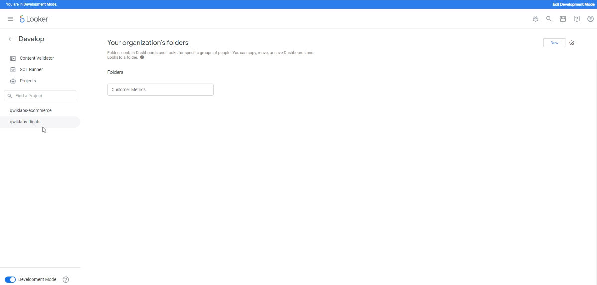

3. Select a project on the left sidebar and open any `.model` file

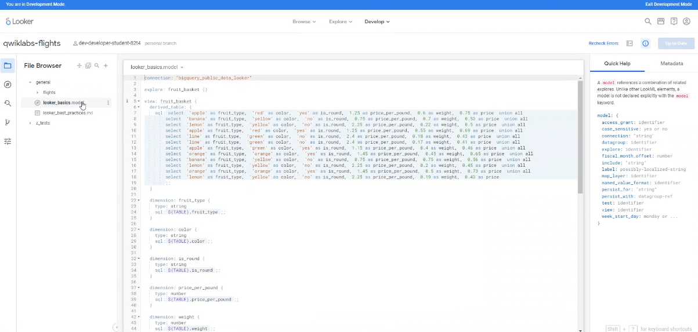

4. Copy and paste the contents of the `ElementRentalLookML.txt` file at the bottom of the `.model` file

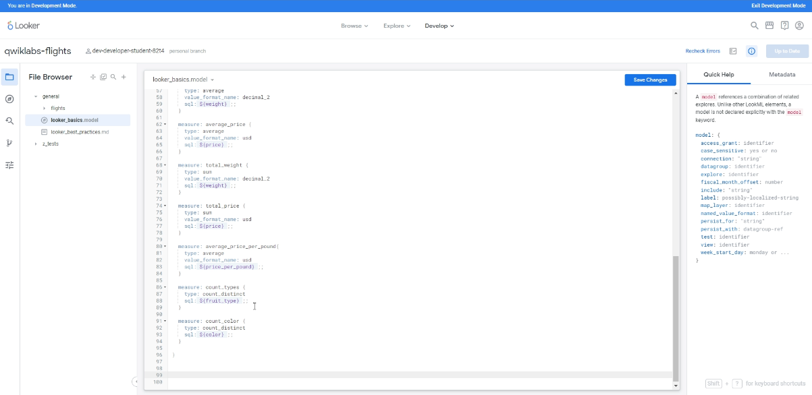
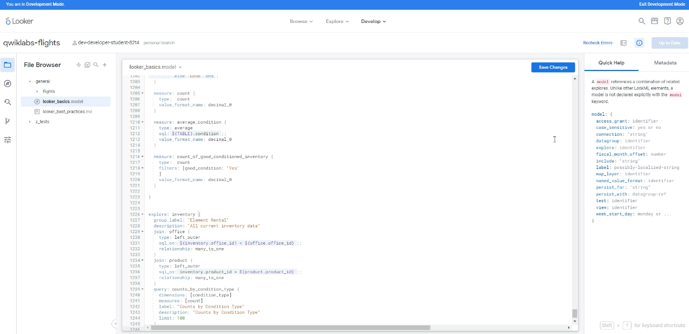

5. Select the Explore tab again and notice the `Element Rental` dropdown on the left sidebar

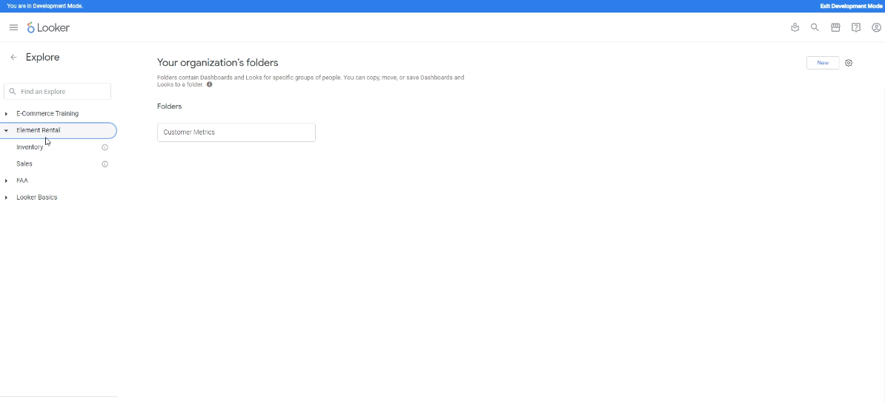

## Terminology

- **Fields** - columns (headers)

- **Dimensions** - subset, field that contains qualitative values (strings, etc) that are used to categorize, segment, or reveal the details in your data. Dimensions are highlighted in blue in Looker.

- **Measures** - subset, numeric quantitative values that you can use to measure, and they can be aggregated. Measures are highlighted in orange in Looker.

- LookML makes dimensions and measures for us.

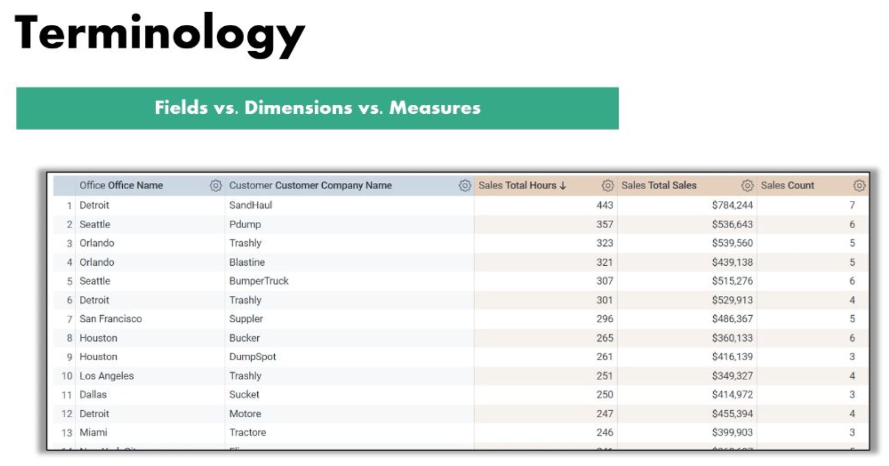

- **Explores** - Looker-specific concept. The starting point for any data exploration and analysis. Capsules for your data. In an Explore, we have our data, our visualization, our filters, our fields.

- **Looks** - Looks are Explores that have been saved. You use Explores to perform an analysis, and a Look is that snapshot that has been saved and can be re-run. You would want to save an Explore to make a Look if you want to run that report at a different point in time (Looks are also called reports).

- **Dashboards** - Dashboards are a complication of different Looks. Dashboards are also interactive, and you can change up the parameters. Dashboards are a great way to see a lot of data in one place.

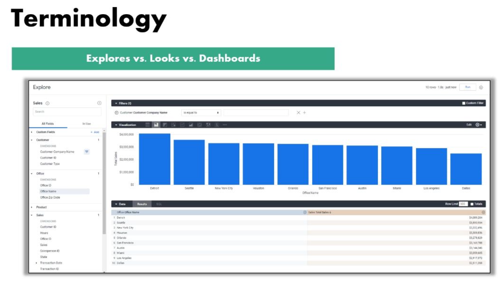

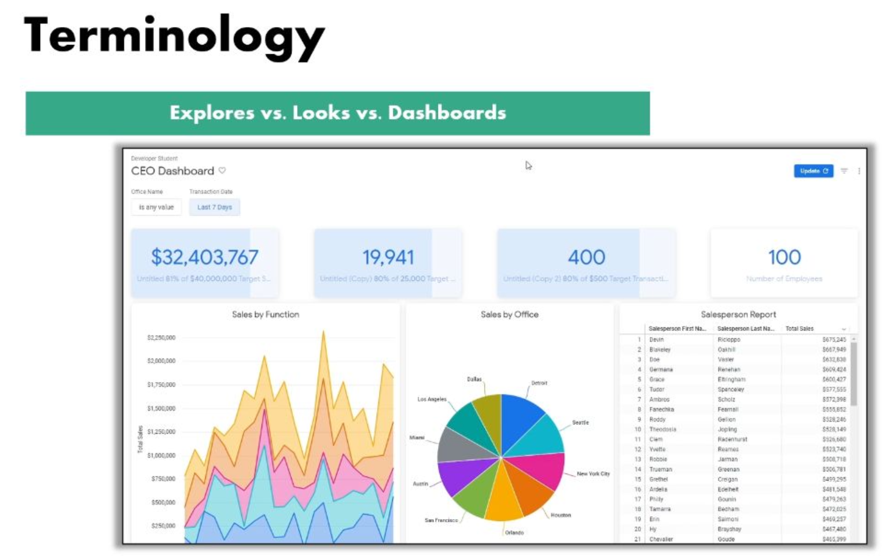

- **Boards** - a Board is used to organize your different Looks. For example, you can pin any Looks related to “Sales” on a Board.

- **Folders** - Folders store your files. You can save Looks in Folders.

- Folders are used to store Looks, and Boards are used to organize Looks.

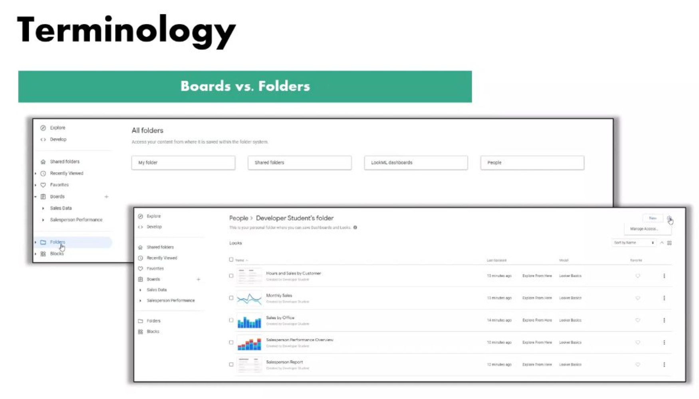

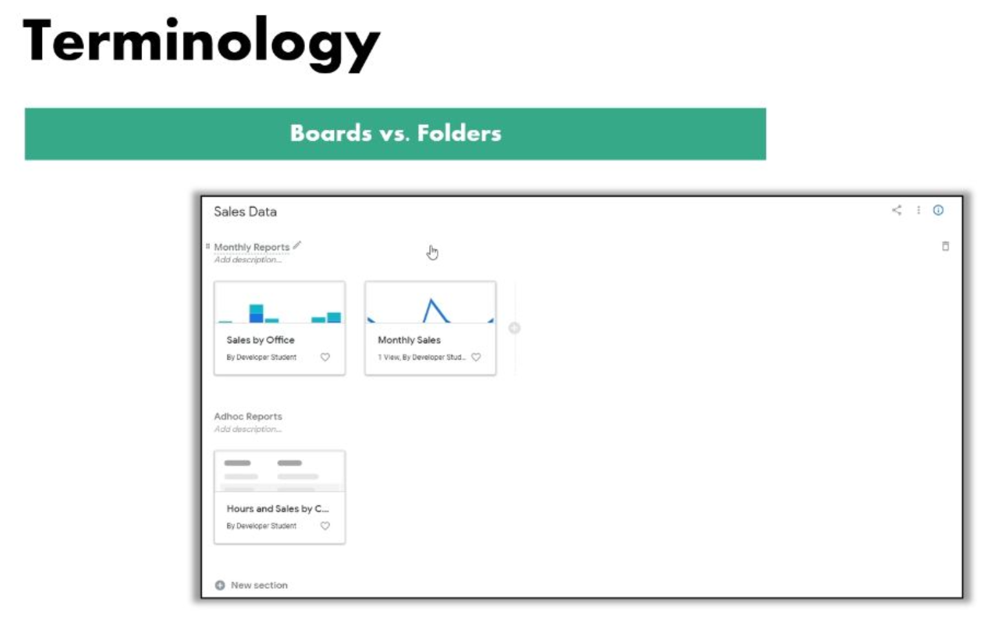

- LookML is used to standardize, so someone can make queries without using code. You can still give users access to the raw data, whereas an ETL would only allow users to access a subset of the data.

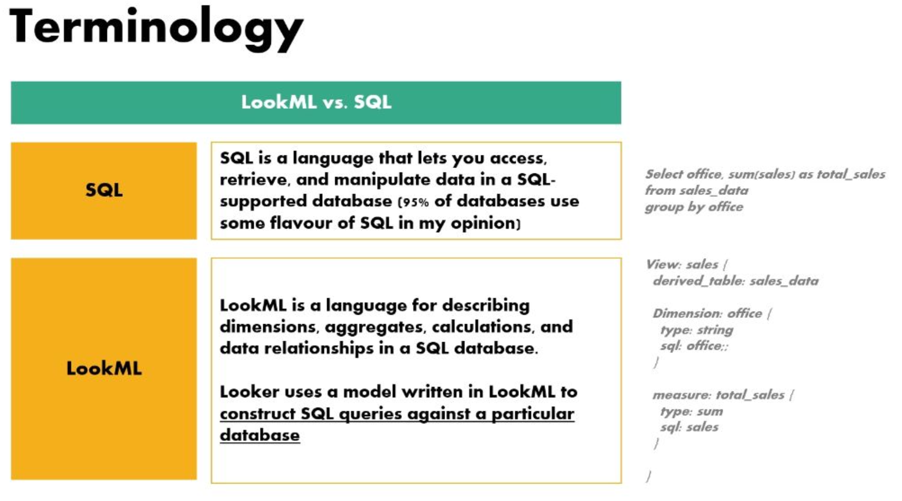

**Developer**

- Caroline Crandell - cecrandell - cecrandell19@gmail.com - [LinkedIn](https://www.linkedin.com/in/carolinecrandell/)